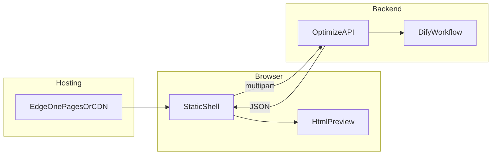

# 在线简历优化工具 · 设计说明

本文描述 **JobMatchStar / ResumePromote** 的产品目标、当前代码实现、Dify 工作流约定与部署方式。快速上手见根目录 [README.md](../README.md)。

---

## 概述

### 核心目标

自建静态前端托管于 EdgeOne Pages（或其它静态托管），用户在页面上传/填写**简历**与**目标岗位 JD**；自有后端（Pages Cloud Functions）持有 Dify API Key 并调用 Workflow；前端展示优化后的 **HTML 简历预览**、**简历分析**、**优化文本**与 **Markdown 提升建议**。不采用 Dify Marketplace 的 EdgeOne Pages 插件自动部署站点。

### 技术选型

| 层级 | 实现 |
| --- | --- |
| 前端 | 原生 HTML / CSS / ES Module，无打包；`marked` + `DOMPurify` 经 import map 从 `esm.sh` 加载 |
| 后端 | `cloud-functions/api/optimize.js` → `POST /api/optimize` |
| 限流 | `cloud-functions/api/rate-limit.js`，EdgeOne Pages KV 固定窗口 |
| 托管 | EdgeOne Pages 静态资源 + Cloud Functions（`edgeone.json` 默认 `maxDuration` 120s） |
| AI | Dify Workflow（blocking 模式）；密钥仅在后端环境变量 |

选用 **Cloud Functions** 而非 Edge Functions：工作流耗时长、请求体较大，边缘函数 CPU 与体积限制更严（见 `optimize.js` 文件头注释）。

### 总体架构



| 层级 | 职责 |
| --- | --- |
| 静态页 | 采集输入、前端校验、调用 `/api/optimize`、渲染结果与安全预览 |
| 后端 | 限流、校验、Dify 文件上传与工作流调用、输出字段映射 |
| Dify | 工作流执行；API Key 不进入浏览器 |

---

## 一、前端实现

### 1.1 页面结构（`index.html`）

单页应用，主要区块：

1. **输入区**：简历、JD 各一个 dropzone（文本框 + 文件选择），支持拖拽；至少各提供一种来源。
2. **操作区**：「开跑优化」提交、「清空」重置。
3. **结果区**（Tab）：
   - **导出简历**（`html`）：iframe 预览 +「在新标签页打开」
   - **优化简历**（`text`）：`optimizedText`，Markdown 渲染
   - **简历分析**（`analysis`）：`analysis`，Markdown 渲染
   - **提升建议**（`tips`）：`suggestions`，Markdown 渲染
4. **隐私说明**：本站不持久化用户数据，生成后请自行保存。

后端另返回 `matchScore`、`modificationPoints`，**当前前端未展示**。

### 1.2 模块划分

| 模块 | 路径 | 职责 |
| --- | --- | --- |
| 入口 | `js/main.js` | 组装表单、Tab、iframe 预览、提交与结果恢复 |
| 配置 | `js/config.js` | `API_BASE`、超时（180s）、`MOCK_OPTIMIZE` |
| API | `js/api/client.js` | `fetch` + `FormData` + `AbortController`；mock 时走 `mock-optimize.js` |
| 限额 | `js/limits.js` | 与后端同名的长度/大小校验及文案 |
| 表单 | `js/ui/forms.js` | `buildOptimizePayload`：必填与限额校验 |
| 拖拽 | `js/ui/dropzones.js` | 文件选择与拖放 |
| 字数 | `js/ui/char-counter.js` | 文本框字数提示 |
| Markdown | `js/ui/markdown.js` | `marked` 解析 + `DOMPurify.sanitize` |
| 会话结果 | `js/ui/session-results.js` | `sessionStorage` 保存本次优化结果（刷新可恢复） |
| 表单草稿 | `js/ui/session-form-draft.js` | `sessionStorage` 存文本；`IndexedDB` 存已选文件 |

### 1.3 交互与安全预览

- 提交中禁用按钮，显示加载态；新提交会 `abort` 上一次请求。
- HTML 预览：`#preview-frame` 使用 **`iframe` + `srcdoc`**，`sandbox=""`（默认禁止脚本、表单、弹窗等），降低 XSS 影响面。
- 「在新标签页打开」：将 HTML 写入 `Blob` URL 后 `window.open`。
- 文本类结果经 Markdown 渲染后写入结果区；**不对模型 HTML 使用 `innerHTML` 写入主文档**。
- 生产环境避免 `console.log` 完整简历/JD。

### 1.4 前端配置（`window.__ENV__`）

在 `index.html` 内联脚本设置，**不得**注入 Dify Key：

| 变量 | 说明 |
| --- | --- |
| `API_BASE` | 后端根地址；与 Cloud Functions 同源时留空 |
| `MOCK_OPTIMIZE` | `true` 时跳过网络，使用 `js/api/mock-optimize.js` |
| `MOCK_DELAY_MS` | mock 延迟毫秒数 |
| `MAX_FILE_BYTES` 等 | 与后端同名限额；留空则用代码默认值 |

---

## 二、后端实现

### 2.1 请求处理（`optimize.js`）

1. 检查 `DIFY_API_KEY`；缺失返回 `500` / `MISSING_DIFY_API_KEY`。
2. `checkRateLimit`（见下）；超限 `429` + `Retry-After`。
3. 解析 `multipart/form-data`；校验至少一份简历与一份 JD。
4. 校验文本长度、单文件大小、请求体合计大小。
5. 文本字段直接写入 Dify `inputs`；文件经 `/v1/files/upload` 上传后以 `local_file` 引用。
6. `POST /v1/workflows/run`，`response_mode: "blocking"`。
7. 将工作流 `outputs` 映射为 JSON 响应（字段名可通过 `DIFY_OUTPUT_*` 覆盖）。

`user` 标识：请求头 `x-user-id` → 环境变量 `DIFY_DEFAULT_USER` → 默认 `resume-promote-web`。

### 2.2 输出字段映射

工作流 outputs 的 key 与 HTTP 响应字段对应关系（可通过环境变量改名）：

| 环境变量 | 默认 Dify key | 响应 JSON 字段 |
| --- | --- | --- |
| `DIFY_OUTPUT_TEXT` | `resume_text` | `optimizedText` |
| `DIFY_OUTPUT_HTML` | `resume_html` | `html` |
| `DIFY_OUTPUT_ANALYSIS` | `analyse` | `analysis` |
| `DIFY_OUTPUT_SUGGESTIONS` | `suggestions` | `suggestions` |
| `DIFY_OUTPUT_MATCH` | `matchScore` | `matchScore` |
| `DIFY_OUTPUT_CHANGELOG` | `modificationPoints` | `modificationPoints` |

输入侧默认：`resume_str`、`job_desc`、`resume_file`、`jd_file`（`DIFY_INPUT_*` 可覆盖）。

### 2.3 KV 限流（`rate-limit.js`）

- 先检查**全站**再检查**按 IP**；任一超限即 `429`。
- 错误码：`RATE_LIMIT_GLOBAL_EXCEEDED`、`RATE_LIMIT_IP_EXCEEDED`（兼容 `RATE_LIMIT_EXCEEDED`）。
- 未绑定 KV 或 KV 异常时默认 **fail-open**（`RATE_LIMIT_FAIL_OPEN=true`），便于本地开发。
- 控制台绑定 Namespace，变量名与 `RATE_LIMIT_KV_BINDING` 一致（默认 `RESUME_PROMOTE_KV`）。

---

## 三、API 契约

### 3.1 请求

- **方法 / 路径**：`POST /api/optimize`
- **Content-Type**：`multipart/form-data`

| 字段 | 说明 |
| --- | --- |
| `resume_str` | 简历文本（可选，与文件至少其一） |
| `job_desc` | JD 文本（可选，与文件至少其一） |
| `resume_file` | 简历文件 Word/PDF（可选） |
| `jd_file` | JD 文件 Word/PDF（可选） |

支持 `OPTIONS` 预检（`CORS_ORIGIN`，默认 `*`）。

### 3.2 成功响应 `200`

```json
{
  "matchScore": 85,
  "optimizedText": "……",
  "html": "<!DOCTYPE html>……",
  "analysis": "……",
  "suggestions": "……",
  "modificationPoints": "……",
  "meta": { "requestId": "…" }
}
```

### 3.3 错误响应

统一形如 `{ "error": { "code": "STRING", "message": "人类可读" } }`。

| HTTP | code（示例） | 含义 |
| --- | --- | --- |
| `400` | `BAD_MULTIPART` | 无法解析表单 |
| `413` | `PAYLOAD_TOO_LARGE`、`RESUME_FILE_TOO_LARGE`、`JD_FILE_TOO_LARGE` | 请求或文件过大 |
| `422` | `MISSING_RESUME`、`MISSING_JD`、`RESUME_TEXT_TOO_LONG`、`JD_TEXT_TOO_LONG` | 参数缺失或文本超长 |
| `429` | `RATE_LIMIT_*` | KV 限流 |
| `500` | `MISSING_DIFY_API_KEY` | 服务端未配置密钥 |
| `502` | `WORKFLOW_FAILED`、`UPSTREAM_ERROR` | Dify 失败或上游异常 |

前端将 `error.message` 展示在状态区；网络/超时显示通用文案。

### 3.4 上传与文本限额（默认值）

前后端均读取同名环境变量；未配置时代码默认：

| 变量 | 默认 |
| --- | --- |
| `MAX_FILE_BYTES` | 5 MB |
| `MAX_RESUME_TEXT_CHARS` | 2800 字 |
| `MAX_JD_TEXT_CHARS` | 1000 字 |
| `MAX_REQUEST_BYTES` | 12 MB |

前端在 `limits.js` 与 `forms.js` 预校验；后端在 `optimize.js` 再次校验。

---

## 四、环境变量

### 4.1 后端（Pages 环境变量或本地 `.env`）

| 变量 | 必填 | 说明 |
| --- | --- | --- |
| `DIFY_API_KEY` | 是 | Dify Workflow API Key |
| `DIFY_API_URL` | 否 | 默认 `https://api.dify.ai` |
| `DIFY_INPUT_*` / `DIFY_OUTPUT_*` | 否 | 与工作流变量名不一致时映射 |
| `DIFY_DEFAULT_USER` | 否 | 传给 Dify 的 user，默认 `resume-promote-web` |
| `CORS_ORIGIN` | 否 | 默认 `*`；上线建议改为站点 Origin |
| `MAX_*` | 否 | 见上表 |
| `RATE_LIMIT_*` | 否 | 见 `rate-limit.js` 与 README |

完整示例见 `.env.example`。

### 4.2 跨域与同源

静态页与 Cloud Functions **同属一个 Pages 项目**时，`API_BASE` 留空即可。跨域部署需配置 `CORS_ORIGIN` 或网关反代为同源。

---

## 五、Dify 工作流搭建

用户在页面提交简历 + JD → 后端传入 Dify Workflow → 各节点解析、优化、生成 HTML 与建议 → 后端映射字段 → 前端展示。

### 5.1 创建应用

1. Dify 创建 **Workflow** 应用，选择合适模型（如 GPT-4o、Claude 3.5）。
2. 开始节点输入字段需与后端默认 key 对齐（或通过 `DIFY_INPUT_*` 映射）：

| 逻辑 | 建议 Dify 类型 | 默认 key |
| --- | --- | --- |
| 个人简历（文件） | 文件上传 Word/PDF | `resume_file` |
| 个人简历（文字） | 长文本 | `resume_str` |
| 岗位 JD（文件） | 文件上传 Word/PDF | `jd_file` |
| 岗位 JD（文字） | 长文本 | `job_desc` |

至少各提交一种简历来源与一种 JD 来源。

### 5.2 推荐节点链路（6 节点）

以下为工作流设计参考；提示词可直接用于 Dify 配置。

#### 节点 1：用户输入

接收上述四个字段（均可选填，由前端/后端保证至少各有一条有效输入）。

#### 节点 2：LLM — 解析 JD + 分析简历差距

**输出**：`JD 核心提取`、`简历差距分析`（分点短文，供下游引用）。

```text
你是资深HR+简历优化专家，负责解析JD（文件/文字）和个人简历（文件/文字），完成以下2件事：
1.  提取JD核心信息：优先识别JD文件中的内容，若未上传文件则识别JD文字内容，精准提取目标岗位的核心技能、工作要求、任职资格、重点工作内容，用简洁的语言汇总（分点，不冗余）；
2.  分析简历与JD的差距：优先识别简历文件中的内容，若未上传文件则识别简历文字内容，对比JD核心要求，找出简历中缺失的JD关键词、未突出的匹配点、需要优化的内容（如工作经历表述、技能缺失），标注差距重点。
输出格式：先输出JD核心提取，再输出简历差距分析，语言简洁，重点突出，不添加多余内容。
个人简历（文件）：#[节点1-个人简历（文件）输入]#
个人简历（文字）：#[节点1-个人简历（文字）输入]#
岗位JD（文件）：#[节点1-岗位JD（文件）输入]#
目标岗位JD（文字）：#[节点1-岗位JD（文字）输入]#
```

#### 节点 3：LLM — 优化简历

**输出**：

- `优化后的简历（纯文本）` → 映射 `resume_text` / `optimizedText`
- `简历修改点` → 映射 `modificationPoints`（相对原文的变更说明）

```text
你是专业简历优化师，根据以下 JD 核心要求、简历差距分析，优化用户简历（优先识别简历文件内容，未上传文件则识别简历文字内容），要求如下：

1. 内容贴合：将 JD 核心关键词自然融入简历，突出与岗位匹配的工作经历、技能、成果，删除与岗位无关的内容；
2. 成果量化：优化工作经历表述，用数据量化成果（如「负责活动运营」→「负责活动运营，吸引 500+ 用户参与，转化率提升 20%」）；
3. 结构清晰：按「个人信息→核心技能→工作经历→教育背景→项目经历」排列，与 JD 匹配的内容优先展示；
4. 修改点标注（重要）：
   - 对照用户**原始简历**（文件/文字），凡相对原文有改动的文字，必须用半角方括号【】包裹；
   - 需标注的情形：措辞改写、补充量化数据、新增 JD 关键词、合并/拆分表述、删除后替换的等价表述；
   - **未改动的原文**保持原样，**不要**加【】；
   - 整段新增的经历/技能条目，该条全文用【】包裹；
   - 同一句里仅改动的片段加【】，例如：负责活动运营，【吸引 500+ 用户参与，转化率提升 20%】；
   - 禁止虚构经历；仅对真实优化结果标注，不夸大；
   - 【】内不要嵌套【】，不要标注与原文完全相同的句子。
5. 格式规范：输出为可直接复制的纯文本简历正文，段落清晰。

JD核心要求：#[节点2输出-JD核心提取]#
简历差距分析：#[节点2输出-简历差距分析]#
个人简历（文件）：#[节点1-个人简历（文件）输入]#
个人简历（文字）：#[节点1-个人简历（文字）输入]#
```

#### 节点 4：LLM — 生成 HTML 简历

**输入**：仅节点 3 的优化后正文（**不含**修改点清单）。

**输出**：完整 HTML 文档字符串（含 `<!DOCTYPE>`、内联 `<style>`，无外链脚本/图片）→ `resume_html` / `html`。

```text
你是专业前端开发+简历优化专家，根据优化后的纯文本简历，生成可在浏览器中直接渲染的完整 HTML 简历文件，要求如下：
1.  格式标准：生成完整的HTML文件（包含<!DOCTYPE html>、<html>、<head>、<body>标签），代码规范，无语法错误，可被前端作为字符串嵌入 iframe 预览，无需额外打包；
2.  样式适配：添加基础简洁的CSS样式（内嵌在<style>标签中，不依赖外部资源），适配网页展示，字体用微软雅黑/宋体（清晰易读），排版整齐，间距合理，原文本中【】标注的JD关键词用橙色高亮，整体风格专业简洁，符合职场规范；
3.  内容一致：HTML简历内容与优化后的纯文本简历完全一致，结构保持“个人信息→核心技能→工作经历→教育背景→项目经历”，不添加额外内容、不遗漏任何信息；
4.  嵌入适配：无需依赖外部图片、外链 CSS/JS，确保在静态站点中以 iframe 等方式展示时即可正常渲染，降低「资源不可用或不支持的网页类型」类问题；
5.  输出规范：仅输出完整的HTML代码，不添加任何解释、注释，便于后端原样返回给前端展示。
优化后的纯文本简历：#[节点3-优化后简历]#
```

#### 节点 5：LLM — 个性化提升建议

**输出**：Markdown 友好文本 → `suggestions`（前端按 Markdown 渲染）。

```text
你是职场提升顾问，根据简历与JD的差距，给出个性化、可落地的提升建议，重点满足以下要求：
1.  短期项目建议：推荐1-2个「1-3天可完成」的小项目，贴合目标岗位需求，无需复杂技术，能快速补充简历亮点，详细说明项目做法、可呈现的成果；
2.  技能补充建议：针对缺失的核心技能，给出1-2个快速学习方法（如1天速成的在线课程、免费学习资源）；
3.  简历细节建议：补充简历排版、表述细节等优化点，同时可补充HTML简历的简单调整建议（如颜色、字体微调），让简历更专业；
4.  建议简洁：分点清晰，重点突出“短期可落地”，避免空泛建议，语言通俗易懂，用户能直接照着做。
输出格式：分「短期项目建议」「技能补充建议」「简历细节建议」3部分，每部分简洁明了，可直接落地。
JD核心要求：#[节点2输出-JD核心提取]#
简历差距分析：#[节点2输出-简历差距分析]#
优化后的简历：#[节点3-优化后简历]#
```

节点 2 的「简历差距分析」可同时映射为 `analyse` / `analysis`，供前端「简历分析」Tab 展示。

#### 节点 6：结束 / 输出节点

将各节点输出暴露为 Workflow **outputs**，key 与第三节映射表一致。可在 Dify 内用模板整合调试，例如：

```text
✅ 简历优化完成！（JD匹配度：#[自动计算，如85%]#）

### 一、优化后文本简历
#[节点3-优化后简历]#

### 二、简历修改点
#[节点3-简历修改点]#

### 三、HTML 简历
#[节点4输出-HTML简历代码]#

### 四、个性化提升建议
#[节点5输出-提升建议]#
```

### 5.3 发布与联调

1. Dify 控制台分别测试「文件 + 文件」「文本 + 文本」两种提交方式。
2. 检查 HTML 完整、无外链依赖、修改点与正文分离。
3. **Publish** 后于 Settings → API Access 创建 API Key，仅写入后端环境变量。
4. 记录 inputs/outputs 变量名，与 `DIFY_INPUT_*` / `DIFY_OUTPUT_*` 对齐。

---

## 六、部署与验收

### 6.1 EdgeOne Pages

1. 将 `index.html`、`css/`、`js/` 与 `cloud-functions/` 置于同一 Pages 项目。
2. 配置环境变量（至少 `DIFY_API_KEY`）；生产环境绑定 KV 并设置限流。
3. 本地调试：`edgeone pages dev`（常见 `http://localhost:8088/`）。
4. 仅静态预览：`npx serve .` + `MOCK_OPTIMIZE=true`。

### 6.2 验收清单

- [ ] 简历/JD：文件、文本、组合四种方式均可成功
- [ ] 四个结果 Tab 内容正确；HTML iframe 样式正常
- [ ] 超限、缺字段时前后端提示一致
- [ ] 刷新页面后 session 内结果与表单草稿可恢复（同标签页）
- [ ] 控制台与网络面板无密钥泄露；`429` 时限流文案可读

---

## 七、安全与合规

1. **密钥**：`DIFY_API_KEY` 仅在后端；禁止写入前端或公开仓库。
2. **HTML**：工作流应输出无外链依赖的完整文档；前端用 sandboxed iframe 预览；**推荐**后端对 `html` 做 allowlist 消毒（当前实现原样透传）。
3. **隐私**：产品文案声明本站不存储用户简历；Dify 与云厂商日志策略以其官方说明为准。
4. **限流**：生产建议启用 KV，防止接口与 Dify 配额被滥用。
5. **CSP**：可按平台能力为静态页配置 `Content-Security-Policy`，限制脚本与 `frame-src`。

---

## 八、后续维护

- 定期轮换 `DIFY_API_KEY`；泄露后立即作废。
- 优化效果或 HTML 不稳定时，在 Dify 内调整提示词，无需改部署架构（除非 outputs key 变更）。
- 若扩展展示 `modificationPoints`、`matchScore`，仅需改前端结果区；契约已预留字段。
- 静态资源更新后重新发布 Pages；JSON 字段变更需同步后端映射与前端解析。
