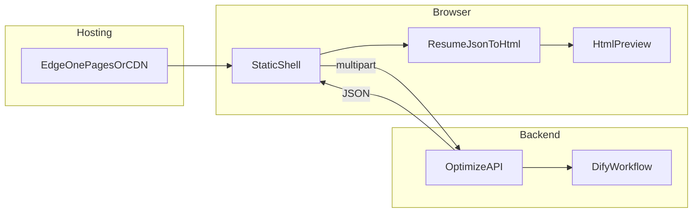

# 在线简历优化工具 · 设计说明

本文描述 **1Job1Resume** 的产品目标、当前代码实现、Dify 工作流约定与部署方式。快速上手见根目录 [README.md](../README.md)。

---

## 概述

### 核心目标

自建静态前端托管于 EdgeOne Pages（或其它静态托管），用户在页面上传/填写**简历**与**目标岗位 JD**；自有后端（Pages Cloud Functions）持有 Dify API Key 并调用 Workflow；工作流**仅输出** `resume_json`、`analyse`、`suggestions` 三项；前端根据 `resume_json` 渲染 **HTML 预览**，并展示**简历分析**与 **Markdown 提升建议**。不采用 Dify Marketplace 的 EdgeOne Pages 插件自动部署站点。

### 技术选型

| 层级 | 实现 |
| --- | --- |
| 前端 | React 19 + TypeScript + Vite；`marked` + `DOMPurify` 经 npm 依赖打包 |
| 后端 | `edge-functions/api/optimize.js`（限流）→ `cloud-functions/api/node/optimize.js`（Dify）；对外 `POST /api/optimize` |
| 限流 | `edge-functions/lib/rate-limit.js`，EdgeOne Pages KV 固定窗口（**仅 Edge Functions**） |
| 托管 | EdgeOne Pages 静态资源 + Cloud Functions（`edgeone.json` 默认 `maxDuration` 120s） |
| AI | Dify Workflow（blocking 模式）；优化节点启用 **Structured Output**；密钥仅在后端环境变量 |
| 简历渲染 | 节点 3 输出六块 `resume`（基础信息 + 五段正文）；HTML 由前端模板渲染 |

选用 **Cloud Functions** 执行 Dify 工作流：耗时长、请求体较大；**KV 限流**按 EdgeOne 官方要求放在 **Edge Functions** 入口，通过后转发 Node。

### 总体架构



| 层级 | 职责 |
| --- | --- |
| 静态页 | 采集输入、前端校验、调用 `/api/optimize`、解析 `resume` JSON、模板渲染 HTML 预览 |
| 后端 | 限流、校验、Dify 文件上传与工作流调用、输出字段映射（含 `resume` 对象透传/校验） |
| Dify | 工作流执行；简历正文由 **Structured Output** 约束为 JSON；API Key 不进入浏览器 |

---

## 一、前端实现

### 1.1 页面结构（`index.html`）

单页应用，主要区块：

1. **输入区**：简历、JD 各一个 dropzone（文本框 + 文件选择），支持拖拽；至少各提供一种来源。
2. **操作区**：「开跑优化」提交、「清空」重置。
3. **结果区**（三个 Tab，与 API 字段一一对应）：
   - **导出简历**：`resume`（← `resume_json`），经 `src/lib/resume/resume-to-html.ts` 生成 HTML 后 iframe 预览 +「在新标签页打开」
   - **简历分析**：`analysis`（← `analyse`），Markdown 渲染
   - **提升建议**：`suggestions`，Markdown 渲染
4. **隐私说明**：本站不持久化用户数据，生成后请自行保存。

### 1.2 模块划分

| 模块 | 路径 | 职责 |
| --- | --- | --- |
| 入口 | `src/main.tsx`、`src/App.tsx` | 组装表单、Tab、iframe 预览、提交与结果恢复 |
| 配置 | `src/config.ts` | `API_BASE`、超时（180s）、`MOCK_OPTIMIZE`（`window.__ENV__` 或 `VITE_*`） |
| API | `src/api/client.ts` | `fetch` + `FormData` + `AbortController`；mock 时走 `mock-optimize.ts` |
| 限额 | `src/lib/limits.ts` | 与后端同名的长度/大小校验及文案 |
| 表单 | `src/lib/forms.ts` | `buildOptimizePayload`：必填与限额校验 |
| 拖拽 | `src/components/Dropzone.tsx` | 文件选择与拖放 |
| Markdown | `src/lib/markdown.ts` | `marked` 解析 + `DOMPurify.sanitize` |
| 简历渲染 | `src/lib/resume/resume-to-html.ts` | 将 `resume` JSON 转为无外链依赖的完整 HTML 文档 |
| 会话结果 | `src/lib/session-results.ts` | `sessionStorage` 保存 `resume` / `analysis` / `suggestions`（刷新可恢复） |
| 表单草稿 | `src/lib/session-form-draft.ts` | `sessionStorage` 存文本；`IndexedDB` 存已选文件 |

### 1.3 交互与安全预览

- 提交中禁用按钮，显示加载态；新提交会 `abort` 上一次请求。
- HTML 预览：由**本地模板**根据 `resume` JSON 生成 HTML 字符串（非模型直出 HTML），再写入 `#preview-frame`（**`iframe` + `srcdoc`**，`sandbox=""`）。
- 「在新标签页打开」：将渲染后的 HTML 写入 `Blob` URL 后 `window.open`。
- 文本类结果经 Markdown 渲染后写入结果区；**不对任何 HTML 使用 `innerHTML` 写入主文档**（仅 iframe `srcdoc`）。
- 生产环境避免 `console.log` 完整简历/JD。

### 1.4 前端配置（`window.__ENV__`）

在 `index.html` 内联 `window.__ENV__` 或构建时 `.env` 的 `VITE_*` 变量设置，**不得**注入 Dify Key：

| 变量 | 说明 |
| --- | --- |
| `API_BASE` | 后端根地址；与 Cloud Functions 同源时留空 |
| `MOCK_OPTIMIZE` | `true` 时跳过网络，使用 `src/api/mock-optimize.ts` |
| `MOCK_DELAY_MS` | mock 延迟毫秒数 |
| `MAX_FILE_BYTES` 等 | 与后端同名限额；留空则用代码默认值 |

---

## 二、后端实现

### 2.1 请求处理

**Edge Functions**（`edge-functions/api/optimize.js`，对外 `/api/optimize`）：

1. `OPTIONS`：CORS 预检。
2. `POST`：`checkRateLimit`（见 2.3）；超限 `429` + `Retry-After`。
3. 通过后 `fetch` 转发至 Node：`/api/node/optimize`（同源内部路由）。

**Node Cloud Functions**（`cloud-functions/api/node/optimize.js`）：

1. 检查 `DIFY_API_KEY`；缺失返回 `500` / `MISSING_DIFY_API_KEY`。
2. 解析 `multipart/form-data`；校验至少一份简历与一份 JD。
3. 校验文本长度、单文件大小、请求体合计大小。
4. 文本字段直接写入 Dify `inputs`；文件经 `/v1/files/upload` 上传后以 `local_file` 引用。
5. `POST /v1/workflows/run`，`response_mode: "blocking"`。
6. 将工作流 `outputs` **仅**映射三项：`resume_json` → `resume`（对象）、`analyse` → `analysis`、`suggestions` → `suggestions`（`DIFY_OUTPUT_*` 可改名）。

`user` 标识：请求头 `x-user-id` → 环境变量 `DIFY_DEFAULT_USER` → 默认 `resume-promote-web`。

### 2.2 输出字段映射

Dify Workflow **结束节点仅暴露 3 个 output**；HTTP 响应与之对应（另加服务端 `meta`）：

| 环境变量 | 默认 Dify key | 响应 JSON 字段 |
| --- | --- | --- |
| `DIFY_OUTPUT_RESUME` | `resume_json` | `resume`（对象；节点 3 `structured_output`，见 3.2） |
| `DIFY_OUTPUT_ANALYSIS` | `analyse` | `analysis` |
| `DIFY_OUTPUT_SUGGESTIONS` | `suggestions` | `suggestions` |

不再使用：`resume_text`、`resume_html`、`matchScore`、`modificationPoints` 等工作流输出或 API 字段。

输入侧默认：`resume_str`、`job_desc`、`resume_file`、`jd_file`（`DIFY_INPUT_*` 可覆盖）。

### 2.3 KV 限流（`edge-functions/lib/rate-limit.js`）

- **运行时**：Edge Functions only；KV 通过控制台绑定的 **Variable Name** 以全局变量注入（默认 `RESUME_PROMOTE_KV`），用法见 [Pages KV 集成](https://pages.edgeone.ai/document/pages-kv-integration)。
- 先检查**全站**再检查**按 IP**；任一超限即 `429`。
- 错误码：`RATE_LIMIT_GLOBAL_EXCEEDED`、`RATE_LIMIT_IP_EXCEEDED`（兼容 `RATE_LIMIT_EXCEEDED`）。
- 未绑定 KV 或 KV 异常时默认 **fail-open**（`RATE_LIMIT_FAIL_OPEN=true`），便于本地开发。
- 控制台绑定 Namespace，Variable Name 与 `RATE_LIMIT_KV_BINDING` 一致（默认 `RESUME_PROMOTE_KV`）。
- 本地 `edgeone pages dev` 需 `edgeone pages link` 才能同步 KV 绑定。

---

## 三、API 契约

### 3.1 请求

- **方法 / 路径**：`POST /api/optimize`
- **Content-Type**：`multipart/form-data`

| 字段 | 说明 |
| --- | --- |
| `resume_str` | 简历文本（可选，与文件至少其一） |
| `job_desc` | JD 文本（可选，与文件至少其一） |
| `resume_file` | 简历文件 Word/PDF（可选） |
| `jd_file` | JD 文件 Word/PDF（可选） |

支持 `OPTIONS` 预检（`CORS_ORIGIN`，默认 `*`）。

### 3.2 成功响应 `200`

```json
{
  "resume": {
    "basic": {
      "name": "张三",
      "title": "用户运营（电商方向）",
      "email": "zhangsan@example.com",
      "phone": "13800138000",
      "location": "上海",
      "summary": "2 年电商运营经验……"
    },
    "experience": [
      {
        "company": "杭州某电商公司",
        "role": "运营助理",
        "period": "2022.07 – 至今",
        "description": "- 协助【618 大促】……"
      }
    ],
    "education": [
      {
        "school": "某某大学",
        "degree": "市场营销 · 本科",
        "period": "2018 – 2022",
        "description": ""
      }
    ],
    "projects": [
      {
        "name": "店铺大促活动支持",
        "role": "",
        "period": "2023",
        "description": "- 参与 618……"
      }
    ],
    "activities": [
      {
        "name": "校级新媒体中心",
        "role": "干事",
        "period": "2019 – 2020",
        "description": "- 策划……"
      }
    ],
    "skills": [
      { "category": "运营", "items": "活动策划 · 用户增长" }
    ]
  },
  "analysis": "……",
  "suggestions": "……",
  "meta": { "requestId": "…" }
}
```

**`resume` 六块结构（节点 3 Structured Output）**

| 块 | JSON 字段 | 类型 | 说明 |
| --- | --- | --- | --- |
| 基础信息 | `basic` | object | 见下表 |
| 工作经历 | `experience` | array | 每项：公司、职位、时间、介绍 |
| 教育经历 | `education` | array | 每项：学校、学历、时间、介绍（可空） |
| 项目经历 | `projects` | array | 每项：名称、角色、时间、介绍 |
| 活动经历 | `activities` | array | 每项：名称、角色、时间、介绍 |
| 技能 | `skills` | array | 每项：分类、技能项（字符串） |

**`basic`（基础信息）**

| 字段 | 必填 | 说明 |
| --- | --- | --- |
| `name` | 是 | 姓名 |
| `title` | 是 | 目标岗位 |
| `email` / `phone` / `location` / `summary` | 否 | 可 `""` |

**`experience[]` 每条**

| 字段 | 必填 | 说明 |
| --- | --- | --- |
| `company` | 是* | 公司 |
| `role` | 是* | 职位 |
| `period` | 是* | 起止时间 |
| `description` | 是* | 工作介绍（多行，要点用 `-` 开头；改动用【】） |

**`education[]` 每条**：`school`、`degree`、`period`、`description`（后项无内容可 `""`）

**`projects[]` / `activities[]` 每条**：`name`（项目名/活动名）、`role`、`period`、`description`

**`skills[]` 每条**：`category`（如「运营」）、`items`（如 `Excel · 文案`，字符串）

\* 单条经历中四个字段至少有一个非空；无该板块时用 `[]`。

| 规则 | 说明 |
| --- | --- |
| 校验 | `basic.name`/`basic.title` 必填；五个 array **至少一个** `length > 0` |
| 高亮 | `description` / `items` 内 `【】` → 前端橙色高亮 |
| 真实性 | 不得虚构经历 |

### 3.3 错误响应

统一形如 `{ "error": { "code": "STRING", "message": "人类可读" } }`。

| HTTP | code（示例） | 含义 |
| --- | --- | --- |
| `400` | `BAD_MULTIPART` | 无法解析表单 |
| `413` | `PAYLOAD_TOO_LARGE`、`RESUME_FILE_TOO_LARGE`、`JD_FILE_TOO_LARGE` | 请求或文件过大 |
| `422` | `MISSING_RESUME`、`MISSING_JD`、`RESUME_TEXT_TOO_LONG`、`JD_TEXT_TOO_LONG` | 参数缺失或文本超长 |
| `429` | `RATE_LIMIT_*` | KV 限流 |
| `500` | `MISSING_DIFY_API_KEY` | 服务端未配置密钥 |
| `502` | `WORKFLOW_FAILED`、`UPSTREAM_ERROR`、`INVALID_RESUME_JSON` | Dify 失败、上游异常或 `resume_json` 无法解析为对象 |

前端将 `error.message` 展示在状态区；网络/超时显示通用文案。

### 3.4 上传与文本限额（默认值）

前后端均读取同名环境变量；未配置时代码默认：

| 变量 | 默认 |
| --- | --- |
| `MAX_FILE_BYTES` | 5 MB |
| `MAX_RESUME_TEXT_CHARS` | 2800 字 |
| `MAX_JD_TEXT_CHARS` | 1000 字 |
| `MAX_REQUEST_BYTES` | 12 MB |

前端在 `limits.js` 与 `forms.js` 预校验；后端在 `optimize.js` 再次校验。

---

## 四、环境变量

### 4.1 后端（Pages 环境变量或本地 `.env`）

| 变量 | 必填 | 说明 |
| --- | --- | --- |
| `DIFY_API_KEY` | 是 | Dify Workflow API Key |
| `DIFY_API_URL` | 否 | 默认 `https://api.dify.ai` |
| `DIFY_INPUT_*` / `DIFY_OUTPUT_*` | 否 | 输入/输出映射；输出仅 `resume_json`、`analyse`、`suggestions` 三项 |
| `DIFY_DEFAULT_USER` | 否 | 传给 Dify 的 user，默认 `resume-promote-web` |
| `CORS_ORIGIN` | 否 | 默认 `*`；上线建议改为站点 Origin |
| `MAX_*` | 否 | 见上表 |
| `RATE_LIMIT_*` | 否 | 见 `edge-functions/lib/rate-limit.js` 与 README |

完整示例见 `.env.example`。

### 4.2 跨域与同源

静态页与 Cloud Functions **同属一个 Pages 项目**时，`API_BASE` 留空即可。跨域部署需配置 `CORS_ORIGIN` 或网关反代为同源。

---

## 五、Dify 工作流搭建

用户在页面提交简历 + JD → 后端传入 Dify Workflow → 各节点解析、优化、**Structured Output 生成 JSON 简历**与建议 → 后端映射字段 → 前端 JSON→HTML 渲染并展示。

### 5.0 Structured Output 总则

Dify LLM 节点可开启 **[Structured Outputs](https://docs.dify.ai/en/use-dify/nodes/llm)**（节点设置 → Structured Output / JSON Schema）。启用后模型输出写入 `structured_output`，下游通过 `{{#节点ID.structured_output.字段名#}}` 引用。

| 要点 | 说明 |
| --- | --- |
| 推荐模型 | GPT-4o / GPT-4o-mini、Gemini 1.5 Pro、Claude 3.5 等原生 JSON 能力较好的模型 |
| 调用模式 | 本站后端使用 `response_mode: "blocking"`（非流式），与 Structured Output 兼容 |
| 提示词 | 明确要求**仅**输出符合 Schema 的结构化结果；业务说明写在 prompt，勿在 JSON 外加解释性段落 |
| 失败处理 | 节点开启 **Retry on Failure**；可选 **Failure Branch** 返回错误提示 |
| 结束节点 | **仅**映射 `resume_json`、`analyse`、`suggestions` 三个 output |

参考：[Structured Outputs 用户指南](https://docs.dify.ai/versions/3-0-x/en/user-guide/workflow/structured-outputs)。

### 5.1 创建应用

1. Dify 创建 **Workflow** 应用，选择合适模型（如 GPT-4o、Claude 3.5）。
2. 开始节点输入字段需与后端默认 key 对齐（或通过 `DIFY_INPUT_*` 映射）：

| 逻辑 | 建议 Dify 类型 | 默认 key |
| --- | --- | --- |
| 个人简历（文件） | 文件上传 Word/PDF | `resume_file` |
| 个人简历（文字） | 长文本 | `resume_str` |
| 岗位 JD（文件） | 文件上传 Word/PDF | `jd_file` |
| 岗位 JD（文字） | 长文本 | `job_desc` |

至少各提交一种简历来源与一种 JD 来源。

### 5.2 推荐节点链路（5 节点，节点 3 为 Structured Output）

以下为工作流设计参考。与旧版差异：**节点 3 一次完成简历优化并输出 JSON**（不再单独拆「纯文本优化 + JSON 结构化」两步，也不生成 HTML）。

#### 节点 1：用户输入

接收上述四个字段（均可选填，由前端/后端保证至少各有一条有效输入）。

#### 节点 2：LLM — 解析 JD + 分析简历差距

**输出**：`JD 核心提取`、`简历差距分析`（分点短文，供下游引用）。

```text
你是资深HR+简历优化专家，负责解析JD（文件/文字）和个人简历（文件/文字），完成以下2件事：
1.  提取JD核心信息：优先识别JD文件中的内容，若未上传文件则识别JD文字内容，精准提取目标岗位的核心技能、工作要求、任职资格、重点工作内容，用简洁的语言汇总（分点，不冗余）；
2.  分析简历与JD的差距：优先识别简历文件中的内容，若未上传文件则识别简历文字内容，对比JD核心要求，找出简历中缺失的JD关键词、未突出的匹配点、需要优化的内容（如工作经历表述、技能缺失），标注差距重点。
输出格式：先输出JD核心提取，再输出简历差距分析，语言简洁，重点突出，不添加多余内容。
个人简历（文件）：#[节点1-个人简历（文件）输入]#
个人简历（文字）：#[节点1-个人简历（文字）输入]#
岗位JD（文件）：#[节点1-岗位JD（文件）输入]#
目标岗位JD（文字）：#[节点1-岗位JD（文字）输入]#
```

#### 节点 3：LLM — 优化简历（Structured Output）

**节点设置**：开启 **Structured Output**，使用下方 JSON Schema（可视化编辑器或 JSON Schema 模式均可）。

**输入**：节点 1 简历/JD 原文 + 节点 2 的 JD 核心提取、简历差距分析。

**输出**：`structured_output` → 结束节点整体映射为 Workflow output **`resume_json`**（API 字段 `resume`）。

**JSON Schema（六块 + 条目字段，粘贴到 Dify 节点 3）**：

```json
{
  "type": "object",
  "additionalProperties": false,
  "required": ["basic", "experience", "education", "projects", "activities", "skills"],
  "properties": {
    "basic": {
      "type": "object",
      "additionalProperties": false,
      "required": ["name", "title", "email", "phone", "location", "summary"],
      "properties": {
        "name": { "type": "string" },
        "title": { "type": "string" },
        "email": { "type": "string" },
        "phone": { "type": "string" },
        "location": { "type": "string" },
        "summary": { "type": "string" }
      }
    },
    "experience": {
      "type": "array",
      "items": {
        "type": "object",
        "additionalProperties": false,
        "required": ["company", "role", "period", "description"],
        "properties": {
          "company": { "type": "string" },
          "role": { "type": "string" },
          "period": { "type": "string" },
          "description": { "type": "string" }
        }
      }
    },
    "education": {
      "type": "array",
      "items": {
        "type": "object",
        "required": ["school", "degree", "period", "description"],
        "properties": {
          "school": { "type": "string" },
          "degree": { "type": "string" },
          "period": { "type": "string" },
          "description": { "type": "string" }
        }
      }
    },
    "projects": {
      "type": "array",
      "items": {
        "type": "object",
        "required": ["name", "role", "period", "description"],
        "properties": {
          "name": { "type": "string" },
          "role": { "type": "string" },
          "period": { "type": "string" },
          "description": { "type": "string" }
        }
      }
    },
    "activities": {
      "type": "array",
      "items": {
        "type": "object",
        "required": ["name", "role", "period", "description"],
        "properties": {
          "name": { "type": "string" },
          "role": { "type": "string" },
          "period": { "type": "string" },
          "description": { "type": "string" }
        }
      }
    },
    "skills": {
      "type": "array",
      "items": {
        "type": "object",
        "required": ["category", "items"],
        "properties": {
          "category": { "type": "string" },
          "items": { "type": "string" }
        }
      }
    }
  }
}
```

**提示词（配合 Schema）**：

```text
你是专业简历优化师。根据 JD 与原始简历，填充 Structured Output。

要求：
1. basic：姓名、联系方式、title（目标岗位）、summary（1-2句，可空字符串）。
2. experience：数组，每项必填 company（公司）、role（职位）、period（时间）、description（工作介绍，多行要点）。
3. education：数组，每项 school（学校）、degree（学历）、period、description（无则 ""）。
4. projects / activities：数组，每项 name、role、period、description。
5. skills：数组，每项 category（分类）、items（技能关键词，字符串）。
6. 无内容的板块用 []；五个板块至少一个非空。改写处用【】包裹；禁止虚构。
7. 仅输出 JSON，不要 Markdown/HTML。

JD 核心要求：#[节点2输出-JD核心提取]#
简历差距分析：#[节点2输出-简历差距分析]#
个人简历（文件）：#[节点1-个人简历（文件）输入]#
个人简历（文字）：#[节点1-个人简历（文字）输入]#
```

**Dify 映射**：`resume_json` ← `{{#节点3.structured_output#}}`（类型 **object**；若为 string，后端 `JSON.parse`）。

#### 节点 4：LLM — 个性化提升建议

**输出**：Markdown 友好文本 → `suggestions`（前端按 Markdown 渲染）。

```text
你是职场提升顾问，根据简历与JD的差距，给出个性化、可落地的提升建议，重点满足以下要求：
1.  短期项目建议：推荐1-2个「1-3天可完成」的小项目，贴合目标岗位需求，无需复杂技术，能快速补充简历亮点，详细说明项目做法、可呈现的成果；
2.  技能补充建议：针对缺失的核心技能，给出1-2个快速学习方法（如1天速成的在线课程、免费学习资源）；
3.  简历细节建议：补充简历排版、表述细节等优化点；可提及导出/预览时的版式偏好（字体、间距），由前端模板统一实现；
4.  建议简洁：分点清晰，重点突出“短期可落地”，避免空泛建议，语言通俗易懂，用户能直接照着做。
输出格式：分「短期项目建议」「技能补充建议」「简历细节建议」3部分，每部分简洁明了，可直接落地。
JD核心要求：#[节点2输出-JD核心提取]#
简历差距分析：#[节点2输出-简历差距分析]#
优化后的简历：#[节点3.structured_output#]#
```

节点 2 的「简历差距分析」可同时映射为 `analyse` / `analysis`，供前端「简历分析」Tab 展示。

#### 节点 5：结束 / 输出节点

Workflow **outputs 仅配置以下 3 项**（勿再添加其它变量）：

| Workflow output key | 来源 |
| --- | --- |
| `resume_json` | 节点 3 `structured_output` → API `resume` |
| `analyse` | 节点 2「简历差距分析」（或节点 2 整段输出中的分析部分） |
| `suggestions` | 节点 4 提升建议 |

调试时确认结束节点 outputs 列表**只有**上述三键，且节点 3 `structured_output` 可被正确引用。

### 5.3 前端 HTML 渲染

由 `src/lib/resume/resume-to-html.ts` 将 `resume` 转为完整 HTML（内联 `<style>`，无外链）：

- 页眉：`basic`；各板块按条目渲染标题行（公司·职位·时间 等）+ 介绍正文
- `description` / `items` 中 `【…】` → 橙色高亮

### 5.4 发布与联调

1. Dify 控制台分别测试「文件 + 文件」「文本 + 文本」两种提交方式。
2. 节点 3 开启 Structured Output 后，确认 `structured_output` 可被结束节点引用且 API 返回可解析为对象。
3. 确认 `resume_json` 含完整六块，且【】标注合理。
4. **Publish** 后于 Settings → API Access 创建 API Key，仅写入后端环境变量。
5. 确认 outputs 仅 `resume_json`、`analyse`、`suggestions`；与 `DIFY_OUTPUT_*` 默认值一致。

---

## 六、部署与验收

### 6.1 EdgeOne Pages

1. 将前端构建产物 `dist/`（`npm run build`）与 `cloud-functions/` 置于同一 Pages 项目；源码在 `src/`、`index.html`。
2. 配置环境变量（至少 `DIFY_API_KEY`）；生产环境绑定 KV 并设置限流。
3. 本地调试：`edgeone pages dev`（常见 `http://localhost:8088/`）。
4. 仅静态预览：`npx serve .` + `MOCK_OPTIMIZE=true`。

### 6.2 验收清单

- [ ] 简历/JD：文件、文本、组合四种方式均可成功
- [ ] 三个结果 Tab 与 API 三字段一致；六块简历在 iframe 中分区展示，【】橙色高亮
- [ ] 超限、缺字段时前后端提示一致
- [ ] 刷新页面后 session 内结果与表单草稿可恢复（同标签页）
- [ ] 控制台与网络面板无密钥泄露；`429` 时限流文案可读

---

## 七、安全与合规

1. **密钥**：`DIFY_API_KEY` 仅在后端；禁止写入前端或公开仓库。
2. **HTML**：由前端模板从 `resume` 生成，不信任模型直出 HTML；iframe `sandbox` 预览；渲染函数对文本做 HTML 转义，禁止拼接未转义的用户/模型字符串。
3. **JSON**：后端对 `resume_json` 做类型检查；解析失败不向前端返回半成品对象。
4. **隐私**：产品文案声明本站不存储用户简历；Dify 与云厂商日志策略以其官方说明为准。
5. **限流**：生产建议启用 KV，防止接口与 Dify 配额被滥用。
6. **CSP**：可按平台能力为静态页配置 `Content-Security-Policy`，限制脚本与 `frame-src`。

---

## 八、后续维护

- 定期轮换 `DIFY_API_KEY`；泄露后立即作废。
- 节点 3 维护六块 + 条目字段；Schema 变更需同步 `src/lib/resume/normalize.ts`、`resume-to-html` 与后端校验。
- 静态资源更新后重新发布 Pages；**禁止**在工作流 outputs 中随意新增字段，以免破坏三字段契约。
